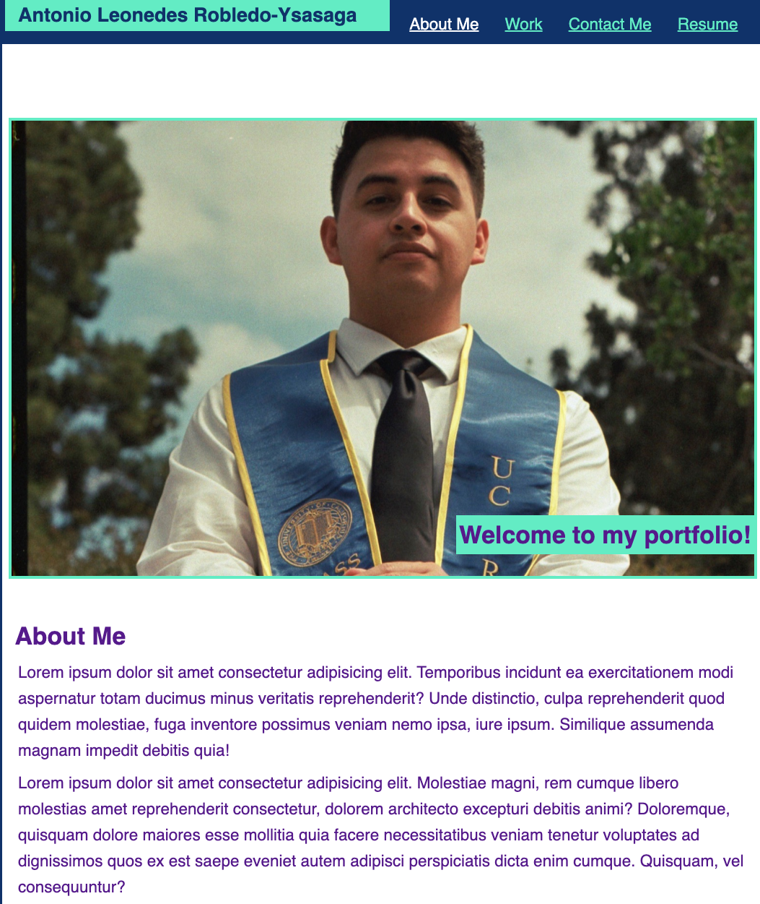
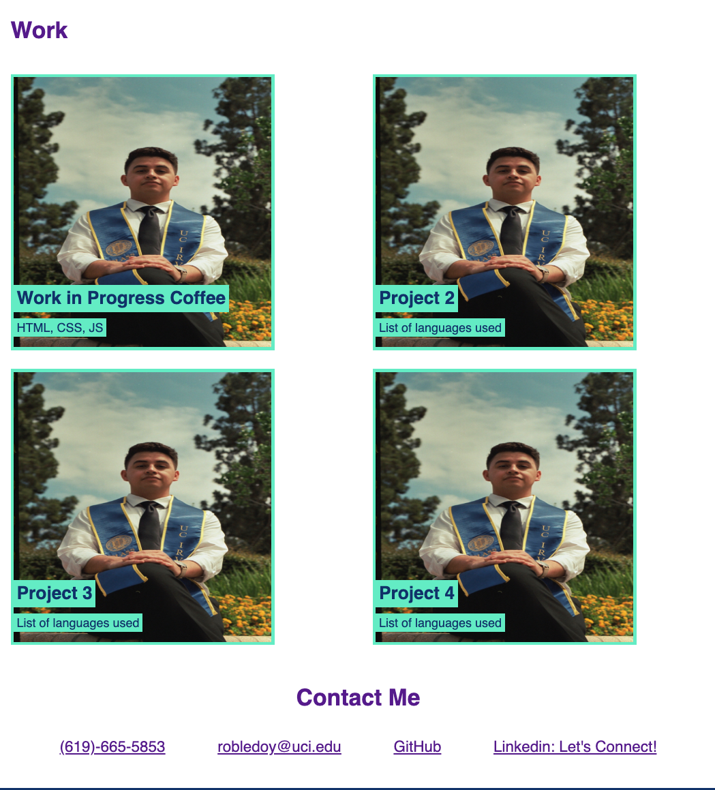
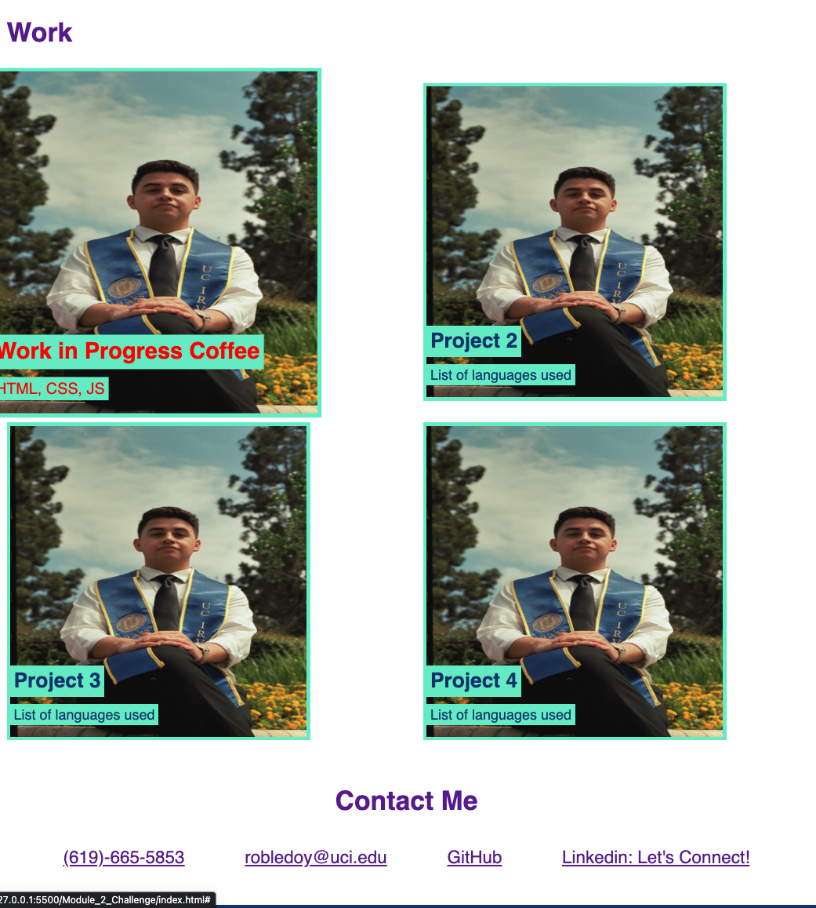

# My Technical Portfolio 

## Description

I have created and styled this portfolio as a way to display my web development projects that I am continuing to work on throughout this course. With time will come more and more impressive projects to add to my showcase. At the top of the page I have added a functioning navigation bar for easier accessibility throughout the portfolio. In developing this site to showcase my skills I have learned how to better utilize HTML and CSS in order to develop a website that is easy to navigate, has easy accessibilty, and is simply laid out in an organized manner.

In the section titled "Work" can be found links to different deployed applications that I have created as well as brief title on the application as well as the languages and frameworks used to create the applications. At the bottom of the page can be found a variety ways to get in touch with me and also a way to visit my GitHub repositories.

 A smaller functionality that I have included can be found in images under the work section: as can be seen, whenever a cursor is moved over an application, the image as well as the text becomes enlarged and changes the font to red.  

## Deployment Link

https://antoniorobledo.github.io/My-Technical-Portfolio/
